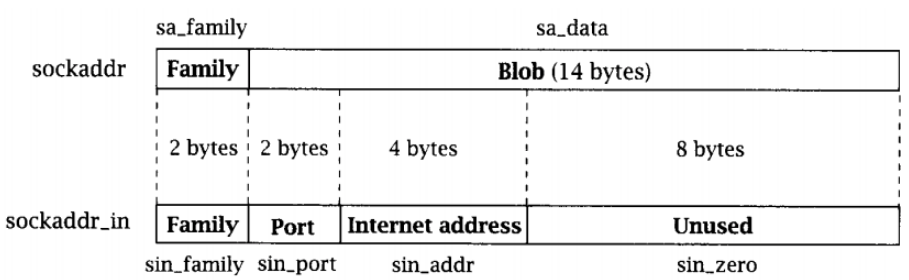

# API

Library **sys/socket.h**, included: ``socket()``, ``connect()``, ``send()``, and ``recv()``.

### socket()

Create new socket

```c
int socket(int protocolFamily, int  type, int protocol)
```

* **protocolFamily**: ``AF_INET`` (IPv4 protocol), ``AF_INET6`` (IPv6 protocol), ``PF_INET``: Protocol Family Internet, ``AF_INET``: Address Family Internet.
* **type**: type of socket, ``SOCK_STREAM``: used for TCP, ``SOCK_DGRAM``: used for UDP.
* **protocol**: Protocol used, with protocolFamily = PF_INET, use ``IPPROTO_TCP`` for **TCP** and ``IPPROTO_UDP`` for **UDP**.

### connect()

Connect to socket with specific address.

```c
int connect(int socket,struct sockaddr *addr,unsigned int addrLength) 
```

*  **socket**: created socket from function ``socket()``.
*  **addr**: server address wished to connect.
*  **addrLength**: length of Server address (byte). 4 byte for IPV4, 16 byte for IPV6.

### send()

```c
int send(int socket, const void *msg, unsigned int len, int flag) 
```
```c
int recv(int socket, void *Buff, unsigned int len, int flag)
```

* ``*msg``, ``*buff`` : pointer to **sent** or **received** data array.
*  **len**: **maximum length** of data array (in byte) each time **sent** or **receive**.
*   **flag** : set **sent** or **received** mode. ``0`` for default mode.

``send()`` and  ``receive`` return the number of byte sent or received, return ``-1`` if there is an error.

### close()

Close a socket.

```c
int close(int socket)
```

## Socket Address structure

Library **arpa/inet.h**.

```c
struct sockaddr{ 
    unsigned short sa_family; /* Address family (e.g. AF_INET) */
    char  sa_data[14] ; /* Family-specific address information */
}; 

struct in_addr{
    unsigned long s_addr;
};

struct sockaddr_in{
    unsigned short sin_family; /* Internet protocol (AF_INET) */
    unsigned short sin_port; /* Address port (16 bits) */
    struct in_addr sin_addr; /* Internet address (32 bits) */
    char    sin_zero[8]; /* Not used, must be zero */
};
```

**sockaddr** and **sockaddr_in** are used to set up address parameter for **client** and **server**.

* **sin_family**, **sa_family**: protocolFamily.
* **sin_port**: port of socket.
* **sin_addr**: connect address
* **sin_zero**: not used, set value 0.



-----------

## netinet/in.h

netinet/in.h - Internet Protocol family