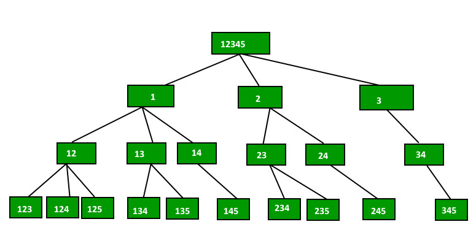

# Find all possible combinations of r elements in a given array of size n

The idea is to start from first index (index = 0) in ``data[]``, one by one fix elements at this index and recur for remaining indexes. 

Let the input array be ``{1, 2, 3, 4, 5}`` and ``r=3``. We first fix 1 at index 0 in data[], then recur for remaining indexes, then we fix 2 at index 0 and recur. Finally, we fix 3 and recur for remaining indexes. When number of elements in ``data[]`` becomes equal to ``r`` (size of a combination), we print ``data[]``.

Full source code: [combination.c](combination.c)