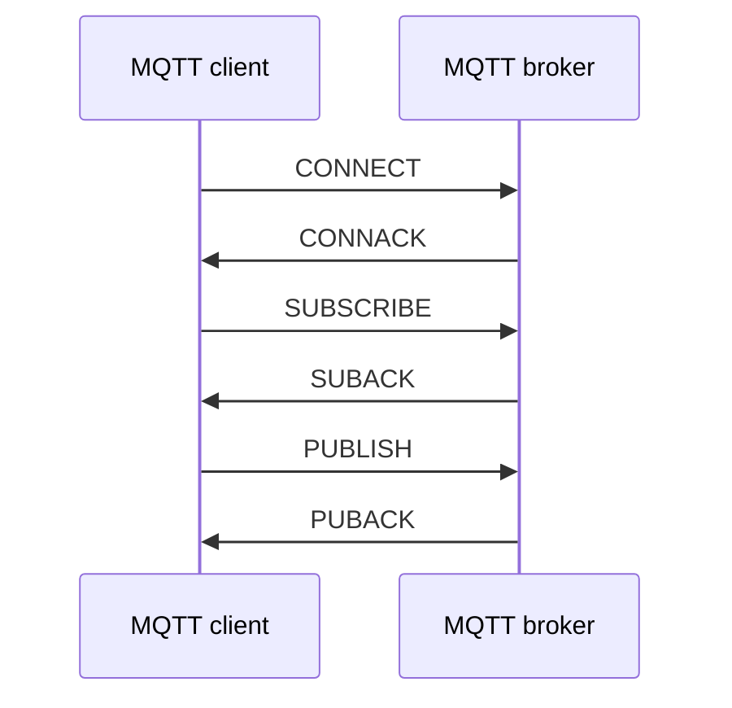

MQTT is a command-response protocol where each command is acknowledged. You cannot publish or subscribe unless you're connected to the MQTT broker.

The following implementation based on [MQTT v3.1.1](https://docs.oasis-open.org/mqtt/mqtt/v3.1.1/os/mqtt-v3.1.1-os.pdf)

Application Message is the data carried by the MQTT protocol across the network for the application. When Application Messages are transported by MQTT, they have an associated **Quality of Service** and a **Topic Name**.

**MQTT Control Packet**: A packet of information that is sent across the Network Connection. The MQTT specification defines fourteen different types of Control Packet, one of which (the PUBLISH packet) is used to convey Application Messages.

Structure of an MQTT Control Packet:
* **Fixed header**, present in all MQTT Control Packets
* **Variable header**, present in some MQTT Control Packets
* **Payload**, present in some MQTT Control Packets

# Fixed header

```c
typedef struct {
    uint8_t control_type; // MQTT Control Packet type
    uint8_t control_flag; // Flags specific to each MQTT Control Packet type
    int packet_length;
} mqtt_fix_header_t;
```
The Remaining Length is the number of bytes remaining within the current packet, including data in the variable header and the payload. 

<table>
    <thead>
        <tr>
            <th>Bit</th>
            <th>7-4</th>
            <th>3-0</th>
        </tr>
    </thead>
    <tbody>
        <tr>
            <td>Byte 1</td>
            <td>MQTT Control Packet type <br>(in short: control type)</td>
            <td>Flags specific to each MQTT Control Packet type <br> (in short: control flag)</td>
        </tr>
        <tr>
            <td>Byte 2...</td>
            <td colspan=2>Remaining Length</td>
        </tr>
    </tbody>
</table>

The Remaining Length field of fixed header is used to encode the length of the remaining of the MQTT Control Packet. The length of the remaining of the MQTT Control Packet data include the size of the variable header and the payload, as the size of the ``MQTT Control Packet = 1 byte (MQTT Control Packet type + MQTT Control Packet type specific flag) + variable header's size + payload's size``.

The Remaining Length is encoded using a variable length encoding scheme which uses a single byte for values up to 127. Larger values are handled as follows. The least significant seven bits of each byte encode the data, and the most significant bit is used to indicate that there are following bytes in the representation. Thus each byte encodes 128 values and a "continuation bit". The maximum number of bytes in the Remaining Length field is four.

remaining_length = 64, it will be encoded as itself 0d64 = 0x40

remaining_length = 321 = 0b101000001. Take the first 7 bits of 321 (from LSB), it will be 0b1000001. As there are still bit lefts in remaining_length, add bit 1 to the first 7 bits, it will be 0b11000001 = 0d193. The bit left is 0b10 = 0d2. So the remaining_length is encoded to be {193, 2} 

remaining_length = 268435455 = 0b1111111111111111111111111111. Take the first 7 bits of 268435455, it will be 0b1111111. As there are still bit lefts in remaining_length, add bit 1 to the first 7 bits, it will be 0b11111111 = 0xff. Same for the left one, and the remaining_length is encoded to be {0xFF, 0xFF, 0xFF, 0x7F}

# Variable header
Control Packets PUBLISH (where QoS > 0), PUBACK, PUBREC, PUBREL, PUBCOMP, SUBSCRIBE, SUBACK, UNSUBSCRIBE, UNSUBACK has its variable header include the **Packet Identifier**.

**Packet Identifier** is 2 bytes include **Packet Identifier MSB** (byte 1) and **Packet Identifier LSB** (byte 2).

**SUBSCRIBE**, **UNSUBSCRIBE**, and **PUBLISH** (in cases where **QoS > 0**) Control Packets **MUST** contain a non-zero 16-bit Packet Identifier.

# MQTT message flow



# CONNECT – Client requests a connection to a Server 
After a Network Connection is established by a Client to a Server, the first Packet sent from the Client to the Server MUST be a CONNECT Packet

The payload of the CONNECT Packet contains one or more length-prefixed fields, whose presence is determined by the flags in the variable header. These fields, if present, **MUST** appear in the order **Client Identifier, Will Topic, Will Message, User Name, Password**.

The Client Identifier (ClientId) identifies the Client to the Server. Each Client connecting to the Server has a unique ClientId. The ClientId MUST be used by Clients and by Servers to identify state that they hold relating to this MQTT Session between the Client and the Server.
# SUBSCRIBE
When the Server receives a SUBSCRIBE Packet from a Client, the Server MUST respond with a SUBACK Packet. The SUBACK Packet MUST have the same Packet Identifier as the SUBSCRIBE Packet that it is acknowledging.
