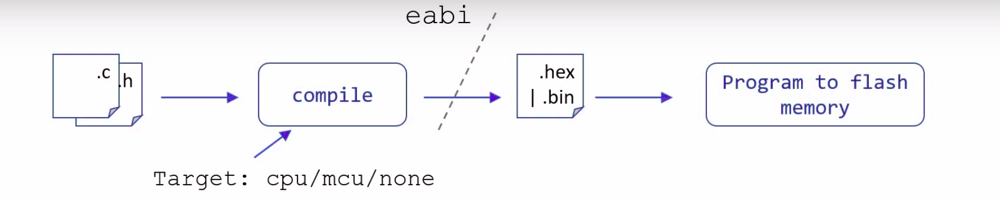
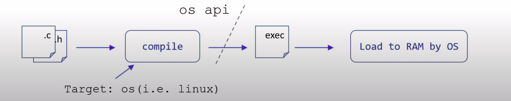

# Fundamental concepts

Bare metal application

OS-based application

``Object files`` -- executable or not -- are typically stored in a container format, such as ``Executable and Linkable Format`` (``ELF``) or ``Portable Executable`` (``PE``) which is Operating System-specific

``Executable and Linkable Format`` (``ELF``, formerly named Extensible Linking Format) is a common standard file format for ``executable files``, ``object code``, ``shared libraries``, and ``core dumps``.

# GCC compilation process

**Preprocessor**

Before compilation, preprocessor takes the source code and perform operation:
* Remove new line, space, comment
* Include header file

**Compilation**: Build the output from preprocessor to assembly code (``.s``)

**Assemble**: Compile assembly code to machine language (0 and 1). ``.o`` or ``.obj`` file will then output, those files (e.g ``main.o``) are all binary files.

# Other definitions

### Cross compiler

A cross compiler is a compiler capable of creating executable code for a platform other than the one on which the compiler is running. For example, a compiler that runs on a Windows 7 PC but generates code that runs on Android smartphone is a cross compiler.

### Toolchain

In software, a **toolchain** is a set of programming tools that is used to perform a complex software development task or to create a software product, which is typically another computer program or a set of related programs. A might include: compiler, linker, preprocessor

A simple software development toolchain may consist of a **compiler** and **linker** (which transform the source code into an executable program), **libraries** (which provide interfaces to the operating system), and a **debugger** (which is used to test and debug created programs).

**Example**:

GNU toolchain include: GNU Compiler

On Windows, you can get the GNU toolchain when install:
* MingGW
* Cygwin
