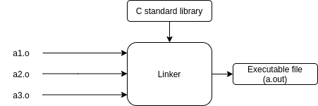

# Fundamental concepts

Bare metal application


OS-based application


**Object files**, executable or not, are typically stored in a container format, such as **Executable and Linkable Format** (**ELF**) or **Portable Executable** (**PE**) which is Operating System-specific.

**Binary format identification**: Each program file includes metainformation describing the format of the executable file. This enables the kernel to interpret the remaining information in the file. Historically, two widely used formats for UNIX executable files were the original **a.out** (“assembler output”) format and the later, more sophisticated **COFF** (Common Object File Format). Nowadays, most UNIX implementations (including Linux) employ the **Executable and Linking Format** (ELF), which provides a number of advantages over the older formats.

**Executable and Linkable Format** (``ELF``, formerly named Extensible Linking Format) is a common standard file format for ``executable files``, ``object code``, ``shared libraries``, and ``core dumps``.

**a.out** as an executable file (compiled in Linux) **is an ELF file**. Verify that by [file](https://github.com/TranPhucVinh/Linux-Shell/blob/master/Physical%20layer/File%20system/Read%20operations.md#file) command:
```
username@hostname:$ file a.out
a.out: ELF 64-bit LSB shared object, x86-64, version 1 (SYSV), dynamically linked, interpreter /lib64/ld-linux-x86-64.so.2, BuildID[sha1]=a03182d85b68de9f8682289e2411d7fa3e5fa820, for GNU/Linux 3.2.0, not stripped
```
## Cross compiler

A cross compiler is a compiler capable of creating executable code for a platform other than the one on which the compiler is running. For example, a compiler that runs on a Windows 7 PC but generates code that runs on Android smartphone is a cross compiler.

## Toolchain

In software, a **toolchain** is a set of programming tools that is used to perform a complex software development task or to create a software product, which is typically another computer program or a set of related programs.

A simple software development toolchain may consist of a **compiler** and **linker** (which transform the source code into an executable program), **assembler**, **libraries** or **runtime libraries** (which provide interfaces to the operating system), a **debugger** (which is used to test and debug created programs), **preprocessor** and **utilities**.

**Example**:

GNU toolchain include: GNU Compiler

On Windows, you can get the GNU toolchain when install:
* MingGW
* Cygwin
# C program compilation process


**Preprocessor**

Before compilation, preprocessor takes the source code and perform operation:
* Remove new line, space, comment
* Include header file

**Compilation**: Build the output from preprocessor to assembly code (``.s``)

**Assemble**: Compile assembly code to machine language (0 and 1). ``.o`` or ``.obj`` file will then output, those files (e.g ``main.o``) are all binary files.

**Linker**: Linker will compile object files (e.g a1.o, a2.o, a3.o,...) and libraries (C standard library, [static library](Static%20library.md), [shared library](Shared%20library.md)) to produce a single executable file.


