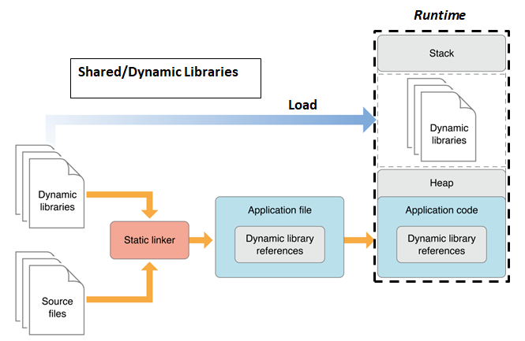

## Fundamental concepts



## Implementation

We need to compile our library source code into position-independent code (PIC) object file ``head.o``: ``gcc -c -fpic head.c``

Creating shared library ``libhead.so`` from an object file: ``gcc -shared -o libhead.so head.o``

Linking with a shared library: ``gcc -L. test.c -lhead``. After running this, ``a.out`` will be the output.

Running that ``a.out`` file will result in error:

```
./a.out: error while loading shared libraries: libhead.so: cannot open shared object file: No such file or directory
```

To run that ``a.out`` file, embedded it inside the ``LD_LIBRARY_PATH`` by running this:

```sh
username$hostname:~$ LD_LIBRARY_PATH=. ./a.out
```
