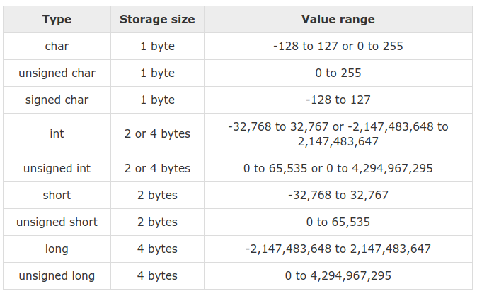

# Data type



## COMPARE

| C | JavaScript|
| ------- |:------:|
|int a = 8; | var a = 8;|
| printf("%d ",a)    | console.log(a)    |

## char vs string

### char

Can store **character** or **integer value**

```c
// character
char c;
c = 'a';
printf("Character %c ", c);
```

```c
// integer
char c;
c = 8;
printf("Integer %d ", c);
```

### char vs value in ASCII code

```c
printf("b: %d \n", '6');	
```

**Result**: 54

### Notes

``char c ='ab'`` => Warning "character constant too long for its type" => **WRONG**

So, **char** in C go only with one word.

### String

```c
char string[] = "hello";
printf("%s", string);
```

**Result**

```
hello
```

### float and double

**double** can also be declared as **long float**.

```
float -> %f

double -> %lf
```

### Comparing float and double

```c
#include <stdio.h>
void main() {
	double x = 3.1;
	float y = 3.1;
	if (x == y){
		printf("YES\n");
	}
	else {
		printf("NO\n");
	}
}
```

**Result**

```
NO
```

### static

**static:** local variable but the value remain unchanged in a function

### size_t

**size_t** is used to save the size of an object of any data type.

**size_t** is actually **long unsigned int**.

```c
typedef unsigned int size_t;
```

So if the value of variable with **size_t** is negative, the result will be unpredictable

```c
#include <iostream>

using namespace std;

int main() {
    size_t a = 0;
    cout << a-2 << endl;
    return 0;
}
```

**Result** ``18446744073709551614``

### stdint.h

stdint.h - integer types

include 

```c
int8_t
int16_t
int32_t
uint8_t
uint16_t
uint32_t
```

### sizeof()

Return the amount of memory allocated to that data type in byte.

**Example 1**

```c
   int a = 16;
   printf("Size of variable a : %d\n",sizeof(a));
   printf("Size of int data type : %d\n",sizeof(int));
   printf("Size of char data type : %d\n",sizeof(char));
   printf("Size of float data type : %d\n",sizeof(float));
   printf("Size of double data type : %d\n",sizeof(double));    
```   

```
Size of variable a : 4
Size of int data type : 4
Size of char data type : 1
Size of float data type : 4
Size of double data type : 8
```

**Example 2**

```c
	int hello[] = {1, 2, 3};
  	char charHello[] = "";
    printf("sizeof: %d \n", sizeof(hello));
    printf("sizeof: %d \n", sizeof(charHello));
```

```
sizeof: 12 (3 int number has total 12 byte)
sizeof: 1 
```