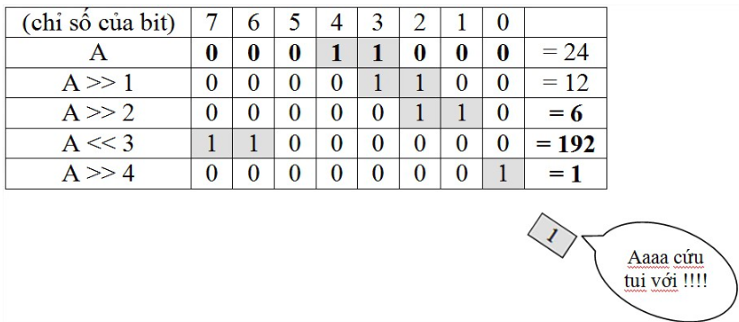

# operator

| OR bit

A = 0011 1100

B = 0000 1101

A|B = 0011 1101

bitwise



```c
shift = shift << 1;
```
can be written as
```c
shift <<= 1;
```

## Binary and Operator

### unsigned char

```c
	unsigned char binVal0 = -3;
	printf("%d \n", binVal0);
```

``253`` (1111 1101)

Signed number is operated by two's implement (bitwise then OR with bit 1).

3 = 0000 0011 => bitwise = 1111 1100
=> -3 = 1111 1100+1 = 1111 1101

### OR and +

```c
	int binVal0 = 0b11;
	int binVal1 = 0b11;
	int binResult = binVal0+binVal1;
	printf("%d", binResult);
```	
**Result** ``6``

```c
	int binVal0 = 0b11;
	int binVal1 = 0b11;
	int binResult = binVal0|binVal1;
	printf("%d", binResult);
```
**Result** ``3``

### bitwise

```c
	int binVal0 = 0b00;
	int binResult = ~binVal0;
	printf("%d \n", binVal0);
	printf("%d \n", binResult);
```

```
0 
-1 
```

The same result for 

```c
	char binVal0 = 0b00;
	char binResult = ~binVal0;
```

### How it works ?

```
int binVal0 = 0b00; //binVal0 = 0b 0000 0000;
int binResult = ~binVal0; //binResult = 0b 1111 1111;
```

When converting back to integer, the duplicate 1 bit from the left is omit, and one bit is kept for sign. So, there is 2 bit left

```
binResult = 0b11 = -1
```

### bitwise unsigned char, unsigned int

```c
	unsigned char binVal0 = 0b0;
	unsigned char binResult = ~binVal0;
	printf("%d \n", binResult);
```	

```
255
```

```c
	unsigned int binVal0 = 0b0;
	int binResult = ~binVal0;
	printf("%d \n", binResult);
```	

```
-1
```

## lvalue, rvalue

``lvale``: left value, the value on the left is modificable, usually a variable.

``rvalue``: Rvalue concept pulls or fetches the value of the expression or operand on the right side of the assignment operator. 

can't use ``PB5 = PB5^1;`` as PB5 is a macro, not variable
