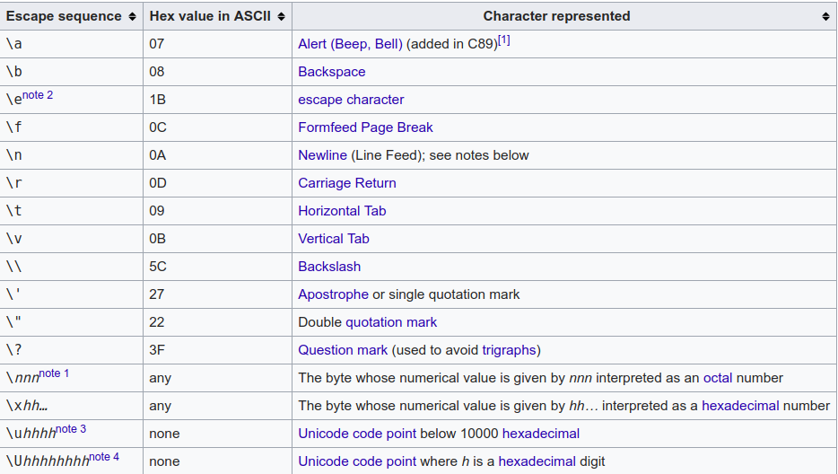

### Data type and ASCII code

**Decimal value**

```c    
printf("%c", 67); 
```

```
C
```

**C** has ASCII code 67

**Hex value**

```c
printf("%c", 0x30);
```

```
0
```

### ASCII code

```c
printf("ASCII value: %d \n", ' ');
```

```
ASCII value: 32 
```

### Escape sequence

**New line**

```c
printf("Hello,%cworld!", 0x0a);
```

```
Hello,
world!
```

New line ``LF`` (line feed) has ASCII code ``0x0a``

The escape sequence ``\n`` does not stand for a backslash followed by the letter n, because the backslash causes an "escape" from the normal way characters are interpreted by the compiler. After seeing the backslash, the compiler expects another character to complete the escape sequence, and then translates the escape sequence into the bytes it is intended to represent. 

### ASCII code with escape symbol

```c
printf("ASCII value: %d \n", '\\');
```

```
ASCII value: 92 
```

(``\`` has ASCII code 92)

From this, it can be seen that ``\`` is an escape symbol.

```c
printf("ASCII value: %d \n", ']'); //93
printf("ASCII value: %d \n", '\]'); // 93
```

**Normal character**

```c
printf("ASCII value: %d \n", 'c'); //99
printf("ASCII value: %d \n", '\c'); //99
```
ASCII value: 99 

However, there are special value that goes with escape sequence:



```c
printf("ASCII value: %d \n", 'a');//97
printf("ASCII value: %d \n", '\a');//7
```

### char type and escape sequence

```c
printf("Char value: %c \n", '\\'); //Char value: \
printf("Char value: %c \n", '\a'); // Char value: 
```

```c
printf("b: %c \n", '\0');
```

```
b:  
```

### Escape sequence: octal vs decimal

```c
printf("ASCII value: %d \n", '\10');
```

**Result**

```
ASCII value: 8 
```

C compiler will understand that the passed-in value after escape sequencer ``\`` is a octal number (10 **octal** has decimal value **8**)