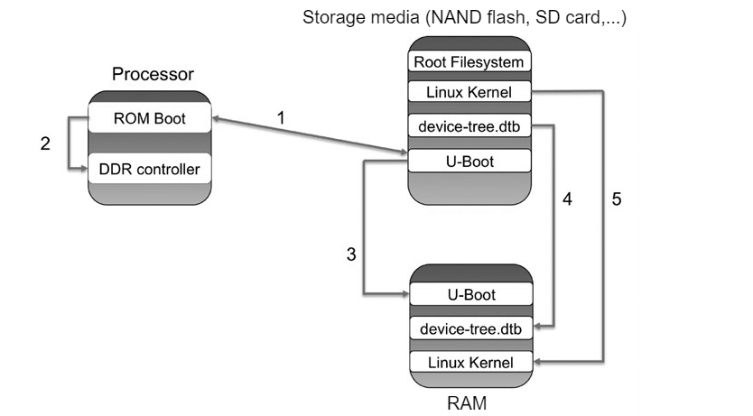

# Linux bootloader

Linux bootloader is a small amount of machine specific code to initialize the system. Its duty is to:

* Configuration of the memory system.
* Loading of the kernel image and the device tree at the correct addresses.
* Optional loading of an initial RAM disk at the correct memory address.
* Setting of the kernel command-line and other parameters (e.g, device tree, machine type)

**U-Boot** (fullname Das U-Boot) is the **bootloader** used in embedded devices, as the **second stage bootloader**, to boot the device's operating system kernel. It is available for various computer architectures, like ARM, RISC-V, x86,...

**U-Boot** is the standard bootloader for ARM Linux so it is also called **ARM U-Boot**.

# Linux booting process

6 steps detail:

* [BIOS](#BIOS) (or **RBL** in SoC computer): System startup/Hardware init with **bootloader**
* **First stage bootloader**: [Master Boot Record (MBR)](#MBR) loads and executes GRUB bootloader
* **Second stage bootloader**: [GRUB](#GRUB) executes Kernel
* [Kernel](#Kernel) will executes process init located in ``/sbin/init``
* Execute [init](#init) process
* Run level: Start userspace for command line

## BIOS

BIOS (Basic Input/Output System) is the firmware/program to perform some system integrity checks, then search, load, and executes the **bootloader program**. Originally, BIOS firmware was stored in a **ROM chip** on the PC motherboard. In later computer systems, the BIOS contents are stored on flash memory so it can be rewritten without removing the chip from the motherboard. In single board computer, this is also known as the **RBL** (**ROM boot loader**).

Once the bootloader program is detected and loaded into the memory, BIOS gives the control to it.

Most BIOS implementations are specifically designed to work with a particular computer or motherboard model, by interfacing with various devices especially system chipset. 

When setting up the PC, you can press a key (typically F12 of F2, but it depends on your system) during the BIOS startup to change the boot sequence.

## MBR

MBR is located in the 1st sector of the bootable disk, typically in ``/dev/sda``, with the small size of less than 512 bytes. It has 3 components:
* Primary bootloader info
* Partition table info
* MBR validation check

MBR contains information about GRUB 

## GRUB

* GRUB stands for Grand Unified Bootloader. If you have multiple kernel images installed on your system, you can choose which one to be executed.
* GRUB displays a splash screen, waits for few seconds, if you don’t enter anything, it loads the default kernel image as specified in the grub configuration file.
* GRUB has the knowledge of the filesystem.
* GRUB configuration file is ``/boot/grub/grub.cfg``. In Ubuntu 20.04 ``grub.cfg`` file, it contains ``initrd`` (Initial RAM Disk) image (checked by searching ``initrd`` in that file). ``initrd`` is used by kernel as temporary root file system until kernel is booted and the real root file system is mounted. It also contains necessary drivers compiled inside, which helps it to access the hard drive partitions, and other hardware.
* GRUB for ARM Linux is also called GRUB Uboot.

## Kernel

* Kernel mount the root file system as specified in ``grub.cfg``.
* Kernel executes the ``/sbin/init`` program. Since init was the 1st program to be executed by Linux Kernel, it has the process id (PID) of 1. 

## init

init process will decide the run level. Ubuntu 20.04 supports [systemd](https://github.com/TranPhucVinh/Linux-Shell/blob/master/Physical%20layer/Systemd.md) to setup run level.

**Command**
* ``runlevel``: print out the current runlevel number
* ``man runlevel``: ``runlevel`` manual, and to also check the meaning of the level number
* ``sudo init 6``: Reboot the OS

# ARM Linux booting process

Linux booting process will follow those steps:

1. The boot process begins at **POR** (**Power On Reset**) where the hardware reset logic forces the ARM core to begin execution starting from the on-chip boot ROM. The boot ROM can support several devices (e.g, NOR flash, NAND flash, SD card, eMMC). (**eMMC** (**embedded Multi Media Controller**) is an on-board memory chip that holds data like the OS).

2. The **U-Boot** loads both the kernel image and the compiled device tree binary into RAM (like DDR3 RAM) and passes the memory address of the device tree binary into the kernel as part of the launch.

3. The U-Boot jumps to the kernel code.

4. Kernel runs low level kernel initialization, enabling MMU and creating the initial table of memory pages, and setting up caches. This is done in ``arch/arm/kernel/head.S``. The file ``head.S`` contains CPU architecture specific but platform independent initialization code. Then the system switches to the non architecture specific kernel startup function ``start_kernel()``.

5. Kernel runs ``start_kernel()`` located in ``init/main.c`` that:

* Initializes the kernel core (e.g., memory, scheduling, interrupts,...). 
* Initializes statically compiled drivers.
* Mounts the root filesystem based on bootargs passed to the kernel from U-Boot.
* Executes the first user process, init. The three init programs that you usually find in Linux embedded devices are BusyBox init, System V init, and systemd.

State machine for those 5 steps

OS source file are stored in the storage media (SD card, NAND flash,...) and is loaded into RAM when running.