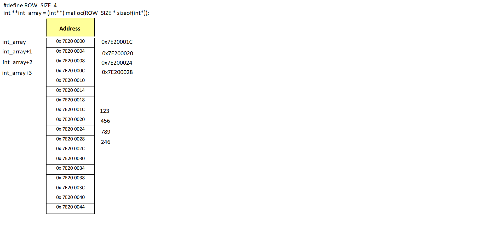

Pointer to pointer is also known as double pointer.

# Create

## Simple define

```c
#include <stdio.h>

int number = 9;

int *pointer = &number;
int **double_pointer = &pointer;

int main(){
	printf("*pointer: %d \n", *pointer);//9
	printf("Address of pointer: %p \n", &pointer);//0x601040
	printf("double_pointer: %p \n", double_pointer);//0x601040
	printf("**double_pointer: %d \n", **double_pointer);//9
}
```

## Define double pointer on heap memory

All define for 2 dimension array with double pointer must have type like:

```c
#define COLUMN_SIZE 4
int **int_array = (int**) malloc(COLUMN_SIZE * sizeof(int*));
```

Take this picture for an example with the register address



As double pointer stores the address of other pointers, so size of pointer (e.g ``sizeof(int*)``, ``sizeof(char*)``,...), which is a constant, is needed to get the register's size.

As ``sizeof(int*)`` returns the size of the register (e.g any register in the picture like ``0x7E200000``, ``0x7E200004``,...), so ``COLUMN_SIZE * sizeof(int*)`` will tell how many register is needed. ``int_array`` now stores the information that how many registers is needed to stored the registers/address of other pointers.

If apply the double pointer allocating to the picture above, 4 registers ``0x7E200000``, ``0x7E200004``, ``0x7E200008``, ``0x7E20000C`` will be used to stored the address of other variables.

In that system, for example register ``0x7E20001C`` has variable value ``123``, same for ``0x7E200020`` with 456, ``0x7E200024`` with ``789`` and ``0x7E200028`` with ``246``.

Then ``int_array`` will store those register address like in the picture above.

That's why ``int_array`` must be allocated to have enough size to store the address value. E.g  ``0x7E200000`` store  ``0x7E20001C``.

For other data type like char, the define must be:

```c
#define COLUMN_SIZE 4
char **char_array = (char**) malloc(COLUMN_SIZE * sizeof(char*));
```

# Applications

* [Two dimension array on heap memory](https://github.com/TranPhucVinh/C/blob/master/Introduction/Data%20structure/Array/Two%20dimension%20array%20on%20heap%20memory.md)
* [Thread creation: Get return from a thread and store to a variable](https://github.com/TranPhucVinh/C/blob/master/Physical%20layer/Thread/Examples.md#get-return-from-a-thread-and-store-to-a-variable)
