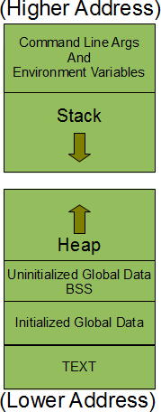

# Memory layout of a C program running as a process



A process also has its environment which comes with environment variables. The startup routine takes the command line arguments, environment etc from the kernel and passes these on to the ``main()`` function.

* The command line arguments and the environment variables are stored at the top of the process memory layout at the higher addresses.
* ``Stack segment`` is the memory area which is used by the process to store the local variables of function and other information that is saved every time a function is called. This other information includes the return address ie the address from where the function was called, some information on the callers environment like its machine registers etc are stored on stack. Also worth mentioning here is that each time a recursive function is called a new stack frame is generated so that the each set of local variables does not interfere with the any other set.

* ``Heap segment`` is the one which is used for dynamic memory allocation. This segment is not limited to a single process, instead it is shared among all the processes running in the system. Any process could dynamically allocate memory from this segment. Since this segment is shared across the processes so memory from this segment should be used cautiously and should be deallocated as soon as the process is done using that memory.

Forget to deallocate memory in HEAP causes Memory leak.

* All the **global** and **static variable** which **are not initialized** or **initiliazed with 0** are stored in the BSS segment (``Block Started by Symbol``). Upon execution, all the uninitialized global variables are initialized with the value zero.

E.g:

```c
int global;
int function_name(){
    static int static_variable = 0;
    return 0;
}
```

``global`` (uninitialized) and ``static_variable`` (initialized with ``0``) are then stored inside the ``DS``.

* All the **initialized global** and **static variables** are stored in the Ininitialized data segment also called Data segment (DS).

E.g:

```c
int global = 100;
int function_name(){
    static int static_variable = 1;
    return 0;
}
```

* ``Text segment`` is the memory area that contains the machine instructions that CPU executes. Usually, this segment is shared across different instances of the same program being executed. Since there is no point of changing the CPU instructions so this segment has ``read-only privileges``.

As seems from the figure above, the stack grows downwards while the heap grows upwards.

# Memory type

Stack and heap memory are both stored on RAM of the PC.

## Stack memory

Stack memory is a temporary memory allocation scheme where the data members are accessible only if the method that contained them is currently is running. Stack memory block is allocated when the source code is compiled. Variables inside the stack memory block of a function are freed up after its execution.

Size of a stack memory block inside the program are fixed. If there is not enough stack memory as calling many nested functions or multiple times of recursion, stack overflow error might happen.

```c
int main()
{
   // All these variables get memory allocated on stack
   int a;
   int b[10];
   int n = 20;
   int c[n];
}
```

## Heap memory

Heap memory block is allocated during run-time. When the size of heap memory is not enough for the program, the OS has the mechanism to increase the heap memory size.

# Data alignment 

### How does CPU access a variable ?

A 8-bit CPU can access a 1 byte (8-bit) variable in 1 CPU cyle. So for a n-byte variable, it takes the CPU ``n`` CPU cycle to access

A 64-bit CPU can access a 8 byte (64-bit) variable in 1 CPU cyle. So for a 8*n byte variable, it takes the CPU ``n`` CPU cycle to access

### Data alignment

In present day CPU, the read/write operation depend on the size of ``word`` (32-bit OS has ``word`` size of 4 byte). Data aligment is the way of arranging data so that its size is the multiple of ``word``, i.e ``4*k`` bytes (``k`` = 0, 1, 2,...). For **data alignment**, we have to add the **dummy byte** in some cases, sometimes known as **padding data**. Data alignment will increase the performance of the system as the read/write operation on the block data now have the size of multiples of word.

## Memory allocation

There are 2 types of memory allocation: Static memory allocation and [dynamic memory allocation](Dynamic%20memory%20allocation).

### Static memory allocation

When creating a variable, the compiler will assign an address to store that variable. We can access that variable by its name or its address. This is known as **static memory allocation**. When performing static memory allocation, the variables with that type will exist till the end of that program. Static memory Allocation is done before program execution so it is faster than dynamic memory allocation

### Dynamic memory allocation

**Dynamic memory allocation** can be defined as a procedure in which the size of a data structure (like array) is changed during the runtime. Variables inside heap memory block are not automatically freed up after execution but are required to be freed up by code (``free`` or ``delete``). Dynamic memory Allocation is done during program execution.

# Pointer

Check [pointer document](Pointer).
